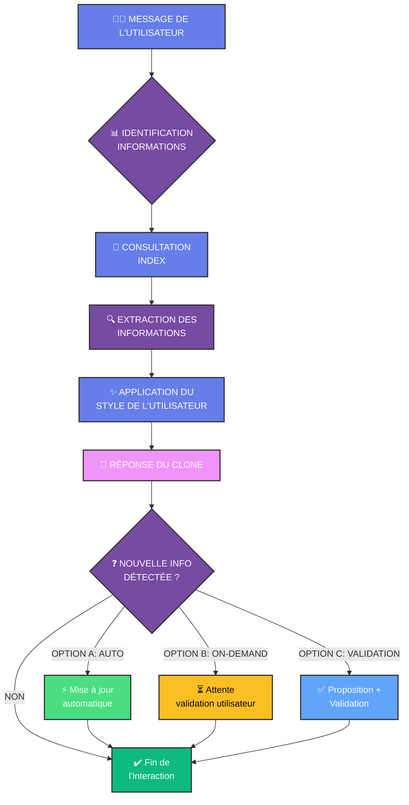

# CLI-KIT-NOVA : Le kit d'externalisation psychée

Bienvenue dans **CLI-KIT-NOVA**, un kit CLI conçu pour l'extraction et la réplication numérique de l'esprit humain. Ce projet propose une approche structurée pour créer un clone digital autonome, capable d'incarner une personnalité, une voix et des connaissances spécifiques.

---

## 💡 Philosophie : L'Externalisation Psychée

Le système NOVA repose sur le principe de **l'externalisation psychée**. L'IA ne s'appuie pas sur ses connaissances générales pour représenter le sujet, mais agit comme un processeur pur. Son identité, ses souvenirs et sa voix sont puisés exclusivement dans une structure de fichiers Markdown (`.md`) organisée.

> **Sécurité et Confidentialité :** L'intégralité de vos données de clonage réside localement sur votre machine. Aucune base de données externe n'est utilisée. Votre "esprit numérique" vous appartient.

---

## 🛠️ Utilisation du Kit

CLI-KIT-NOVA est une boîte à outils **agnostique**. Vous n'avez pas besoin de code spécifique pour l'utiliser. Il vous suffit de coupler cette structure de fichiers avec votre outil **CLI IA** préféré (comme **Gemini CLI**, **Claude Code**, **Codex**, ou **tout autre agent CLI**).

---

## 🔄 Workflow Opérationnel

Voici le pipeline de fonctionnement du système NOVA :



---

## 📖 Guide de A à Z : Créer votre Clone

Pour construire votre clone, suivez scrupuleusement ces étapes dans votre répertoire de projet :

1.  **Préparation des données :** Créez un dossier `nova_memory/` contenant toutes les données brutes sur la personne que vous souhaitez cloner.
2.  **Extraction de l'esprit (`1-Extraire-Esprit.md`) :** Ouvrez votre CLI et coller le prompt contenu dans `1-Extraire-Esprit.md`. Cela va générer la structure de l'esprit numérique.
3.  **Réalisation du MBTI (`2-Clone-Fait-MBTI.md`) :** **Passer le MBTI** et faites **passer le test MBTI (via `MBTI.md`) au clone**, en collant le prompt contenu dans `2-Clone-Fait-MBTI.md`
4.  **Ajustements du clone (`3-Ajustement.md`) :** Coller le prompt contenu dans `3-Ajustement.md` pour faire l'ajustement de personnalité et ajuster le clone.
5.  **Auto-mise à jour du clone (`4-Auto-Mise-A-Jour/`) :** Configurez le mode d'auto-apprentissage du clone. Trois options à votre choix :
    - **Option A** (`4-A-AUTO-MISE-A-JOUR.md`) : **Apprentissage Autonome** — L'IA détecte automatiquement les apprentissages et se met à jour EN SILENCE, sans aucune validation.
    - **Option B** (`A-B-DEMANDER-VERIFICATION.md`) : **Autonome avec Validation** — L'IA détecte les apprentissages automatiquement ET vous les propose. Vous validez ou rejetez avant l'enregistrement.
    - **Option C** (`4-C-SUR-DEMANDE.md`) : **Sur Commande**  **(Recommandé)** — L'IA attend votre ordre ("Mets-toi à jour"). Elle détecte alors les apprentissages, vous les propose, vous validez, elle enregistre.
6.  **Vérification de la Construction (`5-Verifier-Creation.md`) :** Validez que le clone s'est construit correctement en collant le prompt contenu dans `5-Verifier-Creation.md`. Cela va vérifier toute la structure, tester le clone, et proposer les corrections nécessaires avant sa mise en production.

Choisissez le mode qui correspond à vos besoins et collez le prompt correspondant dans votre CLI.

---

## 🏗️ Structure `nova_memory`

```text
nova_memory/
├── NOVA.md              # Hub central : Plan de la mémoire
├── INIT_NOVA.txt        # Directive ontologique (Qui suis-je ?)
├── index/
│   └── index_thematique.md # RAG : Mots-clés -> Fichiers
└── modules/
    ├── personnalite/    # identite.md, croyances.md, style.md
    ├── contexte/        # vie_quotidienne.md, relations.md, etc.
    ├── operationnel/    # directives.md, competences.md
    └── connaissances/   # theorie.md (expertises)
```

---

## 🧠 Modes d'Auto-Mise à Jour : Choisir votre Mode

Le dossier **`4-Auto-Mise-A-Jour/`** contient 3 prompts prêts à copier-coller pour configurer comment votre clone évolue :

| Mode | Fichier | Autonomie | Contrôle | Meilleur pour |
|------|---------|-----------|----------|---------------|
| **A - Auto** | `4-A-AUTO-MISE-A-JOUR.md` | ⭐⭐⭐ Maximale | ❌ Aucun | Clones naturel, évolution rapide |
| **B - Autonome+Validation** | `A-B-DEMANDER-VERIFICATION.md` | ⭐⭐ Automatique | ⭐⭐ Validation | Évolution avec modération |
| **C - Sur Commande** | `4-C-SUR-DEMANDE.md` | ⭐ À la demande | ⭐⭐⭐ Total | **RECOMMANDÉ** — Vous obéit |

### 🤖 Option A : Apprentissage Autonome
Le clone détecte et se met à jour automatiquement EN SILENCE Idéal si vous faites confiance au clone et voulez zéro friction. ⚠️ Risque de dérive progressive.

### 📋 Option B : Autonome avec Validation
Le clone détecte automatiquement ET vous propose chaque changement. Vous validez avant enregistrement. Bon équilibre entre rapidité et sécurité.

### ✅ Option C : Sur Commande (⭐ Recommandé)
L'IA attend votre ordre ("Mets-toi à jour") avant de détecter et proposer. Vous avez le contrôle total du timing. Parfait pour la production.

---

## ✅ Étape 5 : Vérification de la Construction du Clone

Avant d'utiliser votre clone, l'étape **5-Verifier-Creation.md** vous permet de valider complètement que le clone s'est construit correctement. C'est une étape de **contrôle qualité** essentielle qui effectue que le clone marchera.

*Note : Ce projet est un **prototype de développement** prêt à l'usage. Nous vous invitons à tester le kit, à construire vos propres clones et à et l'utiliser comme bon vous semble*

**N'UTILISEZ QUE VOS INFORMATIONS PERSO ET PAS CELLE D'AUTRUI**

Made By GALINIER Mathieu